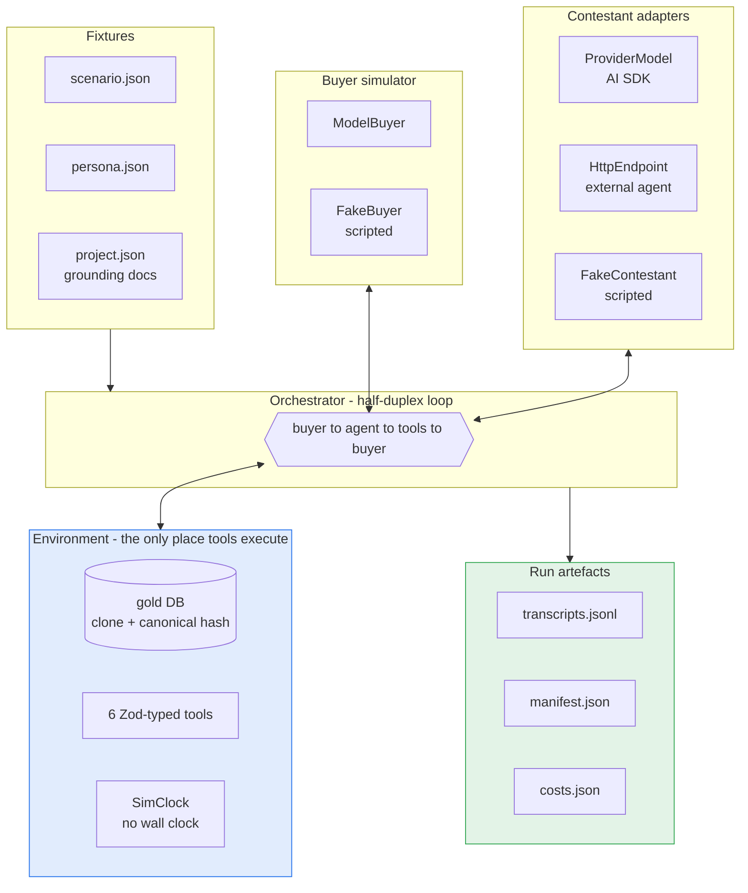
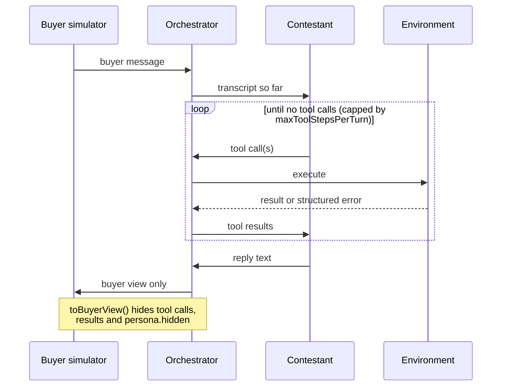

# GharBench

A benchmark harness for evaluating LLM sales agents in WhatsApp-style Indian
real-estate lead conversations.

A buyer persona talks to a contestant model over a simulated WhatsApp thread.
The agent has six typed tools and a grounding document set. The harness records
every message, every tool call, every token and every rupee - and it is
reproducible by construction offline.

> **Status: Phase 0 complete (Gate G1 met). Phase 1 in progress.**
> The engine is wired end to end and provable by a $0 offline run. The
> benchmark _content_ is landing: the grounding corpus (v2, derived and
> drift-checked), all **12 persona cards**, the two-session re-engagement
> flow, a sweep runner, and the first tranche of scenario instances are in.
> `pnpm gate:phase1` reports the authoring floors still open (scenario volume
> toward 60-80 situations / 150-250 instances). The L1.1-L1.13 checks and the
> judge panel are Phase 2. See [Roadmap](#roadmap).
>
> Figures from live provider runs are reported here, not shipped as artefacts -
> `runs/` is gitignored. See
> [Reproducing the numbers](#reproducing-the-numbers-above) for how to check them
> yourself.

---

## Quick start

```sh
nvm use          # Node 22.22.3, pinned in .nvmrc
pnpm install
pnpm smoke       # full mock conversation, offline, no API key, $0
```

That runs a complete buyer-to-agent conversation through the real orchestrator,
tools, logging and telemetry, three times, and fails the build if the three
transcripts are not byte-identical.

```sh
pnpm test        # 115 unit tests
pnpm typecheck
pnpm lint
```

Optional and costs money - a live run against a real provider:

```sh
cp .env.example .env    # add one key
pnpm smoke:live --model=anthropic/claude-haiku-4-5
```

---

## Architecture



The contestant **returns** tool calls; it never runs them. Every tool executes
inside the Environment. That is what makes DB hashing, event capture, and parity
between a local model and a deployed HTTP endpoint possible at all.

### The conversation loop



The buyer never sees the agent's tool calls or their results - only what a
person on WhatsApp would see. `persona.hidden` (budget ceiling, walk-away
triggers, traps) is read by the buyer simulator and nowhere else; a test asserts
no hidden field ever reaches a transcript.

### Termination


A _failed_ flow-ending tool call does not end the conversation - that is tested.
A contestant crash is captured as `{ kind: 'error' }` so a broken run still
produces a complete, writable record.

---

## The six tools

| tool                  | kind  | flow-ending |
| --------------------- | ----- | ----------- |
| `fetch_project_info`  | READ  |             |
| `send_asset`          | READ  |             |
| `check_availability`  | READ  |             |
| `schedule_site_visit` | WRITE |             |
| `escalate_to_human`   | WRITE | yes         |
| `log_qualification`   | WRITE | yes         |

Schemas are `z.strictObject`, so an invented parameter surfaces as a
`schema_violation` instead of being silently dropped.

## Failure is data, not an exception

A bad tool call never throws. It returns a structured error whose `code` is
exactly the event the evaluation layer will consume:

| code                    | meaning                                                                                   |
| ----------------------- | ----------------------------------------------------------------------------------------- |
| `schema_violation`      | args failed the schema - wrong type, unknown key, bad phone format                        |
| `hallucinated_argument` | well-formed args naming something not in the DB                                           |
| `unavailable`           | valid, real args, but the world said no. **A legitimate business outcome, not a defect.** |
| `unknown_tool`          | a tool name that does not exist                                                           |

---

## Two conventions that are load-bearing

### Determinism

`pnpm smoke` runs the scenario three times and fails if the transcripts differ.
No wall clock (`SimClock` is injected and only advances when the orchestrator
ticks it), no `Math.random` (ids are `sequentialId(prefix, count)`), stable
ordering on every list a tool returns, and canonical JSON hashing that sorts
keys at every level.

**This guarantee stops at the provider boundary.** `scenario.seed` is recorded
in the manifest, but no provider in the lineup honours it - Anthropic, OpenAI
and Google all report `seed` as unsupported and sample freely. Only the offline
harness is byte-reproducible. Live reproducibility rests on the pinned model
version, the recorded prompt hashes and the gold-DB hash.

Model **version** pinning is therefore load-bearing rather than cosmetic. A
floating alias like `gpt-4.1-mini` is a pointer a provider can repoint with no
announcement, so the harness resolves aliases to dated snapshots before the call
and records both:

```
pinned openai/gpt-4.1-mini -> gpt-4.1-mini-2025-04-14
```

Every pin is copied from the provider SDK's own model-id union. An alias with no
published dated snapshot is left alone and the run warns that it is not
version-pinned - `gemini-2.5-flash` is currently the gap, because Google
publishes no dated GA snapshot for it and inventing one would be a false
reproducibility claim. Each manifest entry carries `versionPinned`, so a result
states plainly whether it can be reproduced.

### Cache-first prompt layout

Every prompt is assembled stable-prefix-first, variable-content-last:

```
system / policy  ->  tool schemas  ->  docs  ->  conversation so far  ->  this turn
|<-------------- byte-identical on every call -------------->|
```

Caching is a prefix match - one changed byte invalidates everything after it.
So no timestamps, UUIDs or turn counters ever go in a system prompt.

`pnpm smoke:live` **proves** this rather than asserting it: it makes
byte-identical calls and reports the second call's cache-read tokens. Measured:

| provider                     | regime              | result                                       |
| ---------------------------- | ------------------- | -------------------------------------------- |
| `anthropic/claude-haiku-4-5` | explicit breakpoint | call 1 wrote 33,337 / call 2 read **33,337** |
| `openai/gpt-4.1-mini`        | automatic           | call 2 read **30,464**                       |
| `google/gemini-2.5-flash`    | automatic           | call 3 read **34,789**                       |

That check earned its keep immediately: OpenAI requests were being routed to
different backends and caching _nothing_ until a stable `promptCacheKey` was
added. Contestant cache hits went from 1/19 calls to 10/19. Without the probe,
every sweep would have paid list price while believing the cache lever was
engaged.

### Reproducing the numbers above

Those figures come from local runs that are **not in this repo**. `runs/` is
gitignored: a transcript is a full conversation, the directory grows without
bound, and once real personas exist it will contain material that must not be
published (see `docs/decisions/README.md`). So the numbers are reported here,
not shipped as artefacts - take them as claims to check, not as evidence.

Checking them costs a few cents and one key:

```sh
pnpm smoke:live --model=anthropic/claude-haiku-4-5
```

Prefer that model when you have the choice. Anthropic is the only provider here
where the cache **write** and the **read** are both visible, so the mechanism is
proven in both directions rather than inferred from a read alone. Each run writes
its own `transcripts.jsonl`, `manifest.json` and `costs.json` locally.

Nothing above the provider boundary needs a key or a claim of trust: `pnpm smoke`
is $0, offline, and verifies the engine, the tool layer, determinism and the
logging end to end.

---

## Layout

```
src/
  engine/       orchestrator (half-duplex loop), termination tokens
  env/          gold DB (clone, canonical hash, SimClock), the six tools
  contestants/  Contestant interface + provider-model, HTTP-endpoint, fake
  simulator/    buyer simulator (model-backed and scripted)
  providers/    model-ref to LanguageModel registry, cache wiring
  telemetry/    cost meter, price table
  logging/      transcript writer, run manifest
  metrics/      pass^k
  run/          smoke (offline) and smoke:live
stats-bridge/   Python - agreement statistics only, nowhere else
data/           tiny, obviously-fictional mock project
```

## Roadmap

Phase 0 is the engine. Everything that makes it a _benchmark_ is ahead:

- [x] **Phase 0** - TS engine scaffold, orchestrator, tools, telemetry, G1
- [ ] **Phase 1** - the real document set, 12 buyer personas, 60-80 scenarios
- [ ] **Phase 2** - Layer-1 deterministic programmatic checks
- [ ] **Phase 3+** - buyer-simulator validation, judge panel, calibration,
      composite scoring, the scored run and the paper

---

## Licence

[MIT](LICENSE), (c) 2026 Udbhav Bharti.

`docs/tau2-attribution/` is vendored verbatim from tau2-bench and is covered by
its own upstream MIT licence, included in that directory.

---

## Attribution

The half-duplex orchestration pattern and the `###STOP###` / `###TRANSFER###` /
`###OUT-OF-SCOPE###` termination tokens come from **tau2-bench**.
`docs/tau2-attribution/` vendors byte-verified copies of the upstream simulation
guidelines and MIT licence from
[`sierra-research/tau2-bench`](https://github.com/sierra-research/tau2-bench)
at tag `v1.0.1` (commit `fc0055dc`), with sha256 hashes recorded. The
orchestrator is a clean-room reimplementation of the pattern - no Python was
translated.

Work that reports pass^k or uses these tokens should cite:

- Yao et al., _tau-bench_ - [arXiv:2406.12045](https://arxiv.org/abs/2406.12045)
- Barres et al., _tau2-bench_ - [arXiv:2506.07982](https://arxiv.org/abs/2506.07982)
