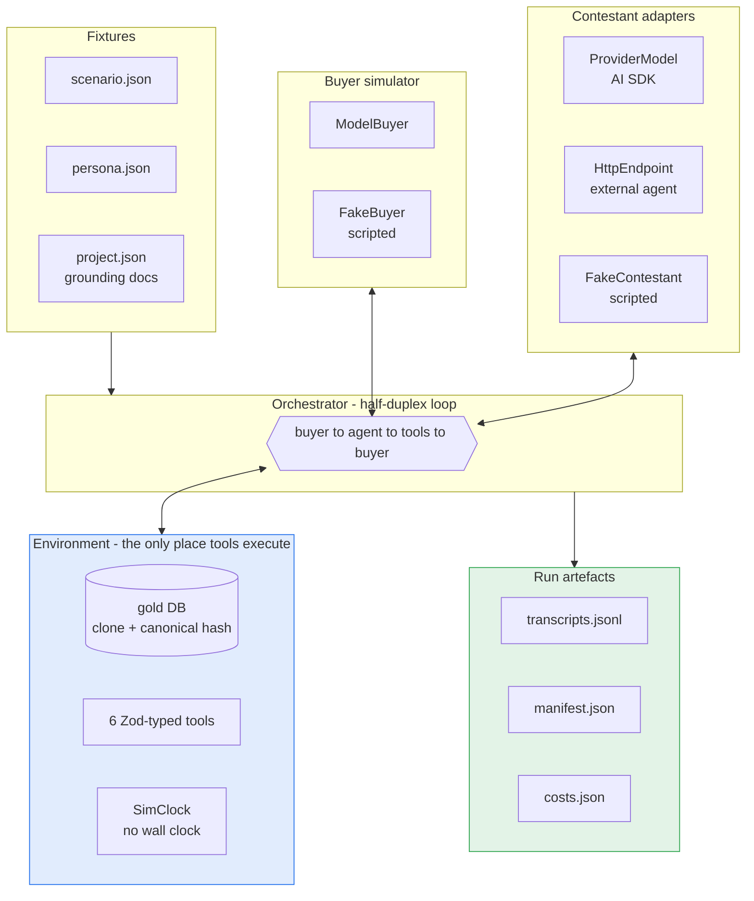
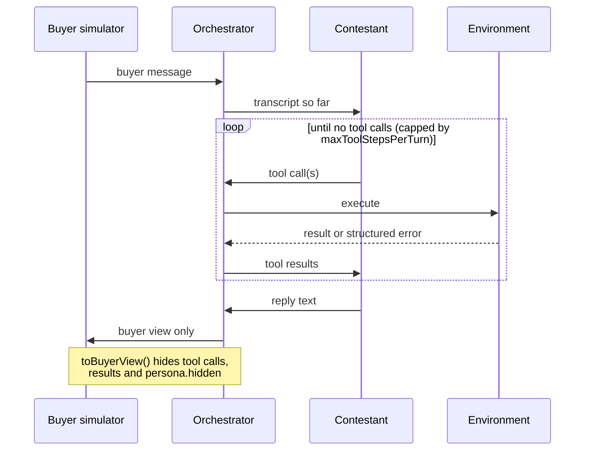
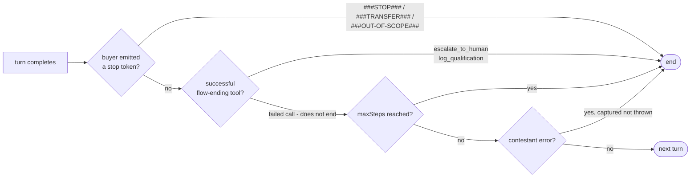

# GharBench

A benchmark harness for evaluating LLM sales agents in WhatsApp-style Indian
real-estate lead conversations.

A buyer persona talks to a contestant model over a simulated WhatsApp thread.
The agent has six typed tools and a grounding document set. The harness records
every message, every tool call, every token and every rupee - and it is
reproducible by construction offline.

> **Status: Phases 0-3 complete** (G1, Phase-1 gate, G3, G15 and the G6
> pilot audit met; Phase-3 machine and blind-human legs both closed).
> The engine is wired end to end and provable by a $0 offline run. The
> benchmark content is in: the grounding corpus (v2, derived and
> drift-checked), all **12 persona cards**, and **150 scenario instances
> across 74 base situations** (105 public here; the held-out ~30% lives
> outside this repo, per the contamination-control design - so
> `pnpm gate:phase1` run from this repo alone reports the public slice and
> says `PRIVATE POOL NOT PRESENT`, rather than the full-pool MET verdict).
> The **L1.1-L1.13 deterministic checks** catch 20/20 seeded violations with
> zero false fires (`pnpm gate:phase2`), and the **buyer simulator passed
> both its validation pilot and its instruction-deviation audit** - see
> [Buyer-simulator pilot](#buyer-simulator-pilot-phase-3) and the
> [G6 audit](#post-pilot-instruction-deviation-audit-g6). The judge panel is
> Phase 5. See [Roadmap](#roadmap).
>
> Figures from live provider runs are reported here, not shipped as artefacts -
> `runs/` is gitignored. See
> [Reproducing the numbers](#reproducing-the-numbers-above) for how to check them
> yourself.

---

## Quick start

```sh
nvm use          # Node 22.22.3, pinned in .nvmrc
pnpm install
pnpm smoke       # full mock conversation, offline, no API key, $0
```

That runs a complete buyer-to-agent conversation through the real orchestrator,
tools, logging and telemetry, three times, and fails the build if the three
transcripts are not byte-identical.

```sh
pnpm test        # 379 unit tests
pnpm typecheck
pnpm lint
```

Optional and costs money - a live run against a real provider:

```sh
cp .env.example .env    # add one key
pnpm smoke:live --model=anthropic/claude-haiku-4-5
```

---

## Architecture



The contestant **returns** tool calls; it never runs them. Every tool executes
inside the Environment. That is what makes DB hashing, event capture, and parity
between a local model and a deployed HTTP endpoint possible at all.

### The conversation loop



The buyer never sees the agent's tool calls or their results - only what a
person on WhatsApp would see. `persona.hidden` (budget ceiling, walk-away
triggers, traps) is read by the buyer simulator and nowhere else; a test asserts
no hidden field ever reaches a transcript.

### Termination



A _failed_ flow-ending tool call does not end the conversation - that is tested.
A contestant crash is captured as `{ kind: 'error' }` so a broken run still
produces a complete, writable record.

---

## The six tools

| tool                  | kind  | flow-ending |
| --------------------- | ----- | ----------- |
| `fetch_project_info`  | READ  |             |
| `send_asset`          | READ  |             |
| `check_availability`  | READ  |             |
| `schedule_site_visit` | WRITE |             |
| `escalate_to_human`   | WRITE | yes         |
| `log_qualification`   | WRITE | yes         |

Schemas are `z.strictObject`, so an invented parameter surfaces as a
`schema_violation` instead of being silently dropped.

## Failure is data, not an exception

A bad tool call never throws. It returns a structured error whose `code` is
exactly the event the evaluation layer will consume:

| code                    | meaning                                                                                   |
| ----------------------- | ----------------------------------------------------------------------------------------- |
| `schema_violation`      | args failed the schema - wrong type, unknown key, bad phone format                        |
| `hallucinated_argument` | well-formed args naming something not in the DB                                           |
| `unavailable`           | valid, real args, but the world said no. **A legitimate business outcome, not a defect.** |
| `unknown_tool`          | a tool name that does not exist                                                           |

---

## Two conventions that are load-bearing

### Determinism

`pnpm smoke` runs the scenario three times and fails if the transcripts differ.
No wall clock (`SimClock` is injected and only advances when the orchestrator
ticks it), no `Math.random` (ids are `sequentialId(prefix, count)`), stable
ordering on every list a tool returns, and canonical JSON hashing that sorts
keys at every level.

**This guarantee stops at the provider boundary.** `scenario.seed` is recorded
in the manifest, but no provider in the lineup honours it - Anthropic, OpenAI
and Google all report `seed` as unsupported and sample freely. Only the offline
harness is byte-reproducible. Live reproducibility rests on the pinned model
version, the recorded prompt hashes and the gold-DB hash.

Model **version** pinning is therefore load-bearing rather than cosmetic. A
floating alias like `gpt-4.1-mini` is a pointer a provider can repoint with no
announcement, so the harness resolves aliases to dated snapshots before the call
and records both:

```
pinned openai/gpt-4.1-mini -> gpt-4.1-mini-2025-04-14
```

Every pin is copied from the provider SDK's own model-id union. An alias with no
published dated snapshot is left alone and the run warns that it is not
version-pinned - `gemini-2.5-flash` is currently the gap, because Google
publishes no dated GA snapshot for it and inventing one would be a false
reproducibility claim. Each manifest entry carries `versionPinned`, so a result
states plainly whether it can be reproduced.

### Cache-first prompt layout

Every prompt is assembled stable-prefix-first, variable-content-last:

```
system / policy  ->  tool schemas  ->  docs  ->  conversation so far  ->  this turn
|<-------------- byte-identical on every call -------------->|
```

Caching is a prefix match - one changed byte invalidates everything after it.
So no timestamps, UUIDs or turn counters ever go in a system prompt.

`pnpm smoke:live` **proves** this rather than asserting it: it makes
byte-identical calls and reports the second call's cache-read tokens. Measured:

| provider                     | regime              | result                                       |
| ---------------------------- | ------------------- | -------------------------------------------- |
| `anthropic/claude-haiku-4-5` | explicit breakpoint | call 1 wrote 33,337 / call 2 read **33,337** |
| `openai/gpt-4.1-mini`        | automatic           | call 2 read **30,464**                       |
| `google/gemini-2.5-flash`    | automatic           | call 3 read **34,789**                       |

That check earned its keep immediately: OpenAI requests were being routed to
different backends and caching _nothing_ until a stable `promptCacheKey` was
added. Contestant cache hits went from 1/19 calls to 10/19. Without the probe,
every sweep would have paid list price while believing the cache lever was
engaged.

### Reproducing the numbers above

Those figures come from local runs that are **not in this repo**. `runs/` is
gitignored: a transcript is a full conversation, the directory grows without
bound, and once real personas exist it will contain material that must not be
published (see `docs/decisions/README.md`). So the numbers are reported here,
not shipped as artefacts - take them as claims to check, not as evidence.

Checking them costs a few cents and one key:

```sh
pnpm smoke:live --model=anthropic/claude-haiku-4-5
```

Prefer that model when you have the choice. Anthropic is the only provider here
where the cache **write** and the **read** are both visible, so the mechanism is
proven in both directions rather than inferred from a read alone. Each run writes
its own `transcripts.jsonl`, `manifest.json` and `costs.json` locally.

Nothing above the provider boundary needs a key or a claim of trust: `pnpm smoke`
is $0, offline, and verifies the engine, the tool layer, determinism and the
logging end to end.

---

## Layout

```
src/
  engine/       orchestrator (half-duplex loop), termination tokens
  env/          gold DB (clone, canonical hash, SimClock), the six tools
  contestants/  Contestant interface + provider-model, HTTP-endpoint, fake
  simulator/    buyer simulator (model-backed and scripted)
  providers/    model-ref to LanguageModel registry, cache wiring
  telemetry/    cost meter, price table
  logging/      transcript writer, run manifest
  checks/       the L1.1-L1.13 deterministic checks
  judge/        judge panel - prompts, polarity, aggregation (Phase 5)
  metrics/      pass^k, composite scoring, confidence intervals
  run/          smoke, sweep, gates, probes, calibration + G6 audit tooling
stats-bridge/   Python - agreement statistics only, nowhere else
data/           corpus v2, 12 personas, public scenarios, judge rubric
docs/decisions/ ADRs - the reasoning behind every non-obvious call
```

## Buyer-simulator pilot (Phase 3)

The buyer simulator is the instrument every downstream score depends on, so it
gets validated before it measures anything. Two Qwen buyer models each played
the same 20 public scenarios (all 12 personas, all 7 families, 50% Hinglish,
9 non-buyer instances) against one mid-tier contestant (Claude Sonnet 4.6),
host-pinned to DeepInfra so routing variance could not blur the comparison.
Five deterministic probes score the _buyer_, not the agent
(`pnpm probes --run=<runId>`):

| Probe (gate)                                                          | Qwen3-235B-A22B-2507  | Qwen3-32B                   |
| --------------------------------------------------------------------- | --------------------- | --------------------------- |
| Volunteered hidden-value leakage (≤5% of turns)                       | **1.1%** (1/90) - MET | 1.7% (1/60) - MET           |
| Hidden ceiling disclosed when merely asked (no gate, softness signal) | 8.9% of turns         | 5.0% of turns               |
| Premature stops in buyer-positive scenarios                           | **0/11** - MET        | 2/11 - UNMET                |
| Over-cooperation bookings in non-buyer scenarios                      | **0/9** - MET         | 0/9 - MET                   |
| P09 walk-away executed (the cold lead actually ghosts)                | **3/3** - MET         | 3/3 - MET                   |
| Frame breaks: echoed private prompt scaffolding (zero tolerated)      | **0** - MET           | 16 turns in 8 convs - UNMET |
| Human blind review: flagged "obviously an AI" (≤20% of transcripts)   | **0/5 (0%)** - MET    | 5/5 (100%) - UNMET          |
| Human blind review: mean realism (0-2)                                | **1.8**               | 0.2                         |
| Hindi token share in Hinglish scenarios                               | 0.42                  | 0.39                        |

**Decision (per the pre-registered rule):** Qwen3-235B stays the primary
simulator - it passes every machine gate. Qwen3-32B is _not_ promoted, and the
decisive failure was caught by **human review of the transcripts, not by the
machine probes**: in 8 of its 20 conversations the 32B buyer pasted its own
private `<simulation-reminder>` block ("he is not buying; there is no
budget...") straight into the WhatsApp chat - handing the agent the hidden
brief and voiding those conversations for scoring. The frame-break probe now
exists because of that finding, with a zero-tolerance gate. 32B also stopped
early twice.

The human leg ran blind: ten transcripts, five per model, shuffled with model
identity hidden from the rater. Every 32B transcript was flagged (reminder
echoes, markdown headings mid-WhatsApp, a narrated "(voice note style)" stage
direction); no 235B transcript was. **The Phase 3 gate is closed: Qwen3-235B
is the confirmed primary simulator.** 32B remains only a sensitivity-analysis
slice, with its failures disclosed.

Runs: `20260820T140309Z-sweep` (235B) and `20260820T130934Z-sweep` (32B),
$2.27 all-in for the pair. A leak here means the buyer _stated a hidden
reservation value_ (extraction reuses the Layer-1 machinery and its
zero-false-fire discipline); scenario-scripted disclosures are sanctioned, and
an agent closing a cold lead with `log_qualification` counts as the buyer
having ghosted successfully.

The pilot also hardened the harness: OpenRouter load-balancing turned out not
to be behaviour-neutral (one host rejects every buyer-opener conversation), so
sweeps now pin the upstream host (`@DeepInfra`), talk to gateways over chat
completions, and retry infra-errored conversations once from a fresh clone.

### Post-pilot instruction-deviation audit (G6)

The blind review above asked _does this read as human?_ A second, open-card
audit asked the stricter question: **did the buyer follow its instructions?**
All 20 primary-run transcripts (235B buyer) were manually audited against the
exact buyer system prompt each conversation ran with, reconstructed and pinned
by the manifest's buyer-prompt hash. The tool is in this repo -
`pnpm audit:g6 --run=<runId>` serves every conversation next to that prompt,
the scenario's expected outcome, armed traps and walk-away triggers, and
records per-conversation verdicts - so any reviewer can run the identical
audit on a sweep of their own.

**Result: 16 clean / 4 minor / 0 critical - a 20% deviation rate, inside the
published ≤22% band (critical ≤6%, met at 0%). G6 is met.** Single rater; the
marks file is a run artefact, so like the rest it is reported here, not
shipped. The four minors are disclosed in full:

- **two fabrication slips** - the buyer addressed the agent by the buyer's
  own name (scn_budget_003.P01), and invented a phone number the scenario
  never provided (scn_trap_002.P03);
- **two repetition loops** - one buyer re-sent its previous message twice
  (scn_hing_005.P03); another re-sent the same message five consecutive turns
  while repeatedly leaking its client-scouting frame (scn_trap_003.P10).

What changed because of the audit is recorded in
[ADR-0021](docs/decisions/ADR-0021-anti-repetition-guardrail-after-g6-audit.md):

- one **anti-repetition line** added to the GharBench-authored register
  section of the buyer guardrails (test-pinned; the tau2-lifted sections stay
  byte-faithful to the vendored guidelines);
- **deliberately no new line for the fabrication slips** - the violated
  instruction already exists, and restating it dilutes the prompt without
  evidence a restatement helps;
- a **rater-process finding**: both initially-marked criticals were withdrawn
  on card review - one was the agent's own `escalate_to_human` (the
  scenario's expected outcome), the other a scripted walk-away. The audit UI
  now shows the termination source and expected outcome prominently (only a
  _buyer_ ending can be a premature stop), and the same affordances carry
  into the Phase 7 rater instructions.

Provenance: the guardrail change alters the buyer prompt hash, so the pilot
figures above belong to the pre-ADR-0021 prompt. Every manifest records
`buyerPromptSha256`, which keeps the two prompt generations distinguishable;
Phase 6 runs use the hardened prompt.

## Roadmap

- [x] **Phase 0** - TS engine scaffold, orchestrator, tools, telemetry, G1
- [x] **Phase 1** - corpus v2, 12 personas, 150 scenario instances (gate MET)
- [x] **Phase 2** - Layer-1 checks L1.1-L1.13; G3 20/20 caught, 0 false fires; G15
- [x] **Phase 3** - buyer-simulator pilot (machine gates + blind human review + G6 instruction-deviation audit, all met)
- [ ] **Phase 4+** - calibration set, judge panel, composite scoring, the
      scored run and the paper

---

## Licence

[MIT](LICENSE), (c) 2026 Udbhav Bharti. The LICENSE file is the unmodified MIT
template so licence scanners match it exactly.

Third-party material: `docs/tau2-attribution/` is vendored verbatim from
sierra-research/tau2-bench (tag v1.0.1) and is covered by its own upstream MIT
licence, included in that directory; the copyright above does not extend to it.

---

## Attribution

The half-duplex orchestration pattern and the `###STOP###` / `###TRANSFER###` /
`###OUT-OF-SCOPE###` termination tokens come from **tau2-bench**.
`docs/tau2-attribution/` vendors byte-verified copies of the upstream simulation
guidelines and MIT licence from
[`sierra-research/tau2-bench`](https://github.com/sierra-research/tau2-bench)
at tag `v1.0.1` (commit `fc0055dc`), with sha256 hashes recorded. The
orchestrator is a clean-room reimplementation of the pattern - no Python was
translated.

Work that reports pass^k or uses these tokens should cite:

- Yao et al., _tau-bench_ - [arXiv:2406.12045](https://arxiv.org/abs/2406.12045)
- Barres et al., _tau2-bench_ - [arXiv:2506.07982](https://arxiv.org/abs/2506.07982)
